Упражнения: Вложени условни конструкции
=======================================

Задачи за упражнение в клас и за домашно към курса ["Основи на програмирането"
\@ СофтУни](https://softuni.bg/courses/programming-basics).

1.Точка върху страната на правоъгълник
------------------------------------

Напишете програма, която проверява дали **точка {x, y}** се намира **върху някоя
от страните на правоъгълник {x1, y1} – {x2, y2}**. Входните данни се четат от
конзолата и се състоят от 6 реда въведени от потребителя: десетичните числа
**x1**, **y1**, **x2**, **y2**, **x** и **y** (като се гарантира, че **x1 \<
x2** и **y1 \< y2**). Да се отпечата "**Border**" (точката лежи на някоя от
страните) или "**Inside / Outside**" (в противен случай).

### Примерен вход и изход

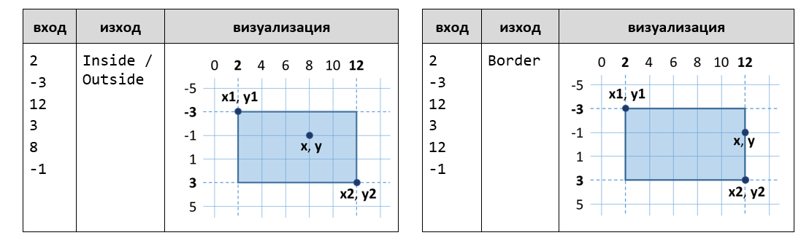

**Тествайте** решението си в **judge системата**:
<https://judge.softuni.bg/Contests/Compete/Index/1162#0>

\* **Подсказка**: използвайте една или няколко условни **if** проверки с
логически операции. Точка **{x, y}** лежи върху някоя от страните на
правоъгълник **{x1, y1} – {x2, y2}**, ако е изпълнено едно от следните условия:

-   **x** съвпада с **x1** или **x2** и същевременно **y** е между **y1** и
    **y2**

-   **y** съвпада с **y1** или **y2** и същевременно **x** е между **x1** и
    **x2**

Можете да проверите горните условия с една по-сложна **if**-**else** конструкция
или с няколко по-прости проверки или с **вложени if**-**else** проверки.

2.Кино
----

В една кинозала столовете са наредени в правоъгълна форма в **r** реда и **c**
колони. Има три вида прожекции с билети на различни цени:

-   **Premiere** – премиерна прожекция, на цена **12.00** лева.

-   **Normal** – стандартна прожекция, на цена **7.50** лева.

-   **Discount** – прожекция за деца, ученици и студенти на намалена цена от
    **5.00** лева.

Напишете програма, която чете **тип прожекция** (стринг), брой **редове** и брой
**колони** в залата (цели числа), въведени от потребителя, и изчислява общите
приходи от билети при пълна зала. Резултатът да се отпечата във формат като в
примерите по-долу, с 2 знака след десетичната точка.

### Примерен вход и изход

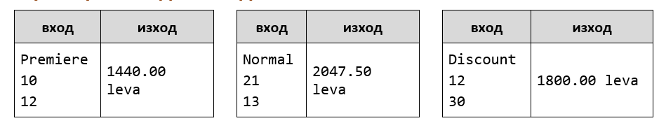

**Тествайте** решението си в **judge системата**:
<https://judge.softuni.bg/Contests/Compete/Index/1162#1>

\* **Подсказка**: използвайте прости проверки и елементарни изчисления. За да
изведете резултата с точно 2 цифри след десетичната точка, използвайте
**Console.WriteLine("{0:f2}", result)**.

3.Волейбол
--------

Влади е студент, живее в София и си ходи от време на време до родния град. Той е
много запален по волейбола, но е зает през работните дни и играе **волейбол**
само през **уикендите** и в **празничните дни**. Влади играе **в София** всяка
**събота**, когато **не е на работа** и **не си пътува до родния град**, както и
в **2/3 от празничните дни**. Той пътува до **родния си град h пъти** в
годината, където играе волейбол със старите си приятели в **неделя**. Влади **не
е на работа 3/4 от уикендите**, в които е в София. Отделно, през **високосните
години** Влади играе с **15% повече** волейбол от нормалното. Приемаме, че
годината има точно **48 уикенда**, подходящи за волейбол.

Напишете програма, която изчислява **колко пъти Влади е играл волейбол** през
годината. **Закръглете резултата** надолу до най-близкото цяло число (например
2.15 2; 9.95 9).

Входните данни се въвеждат от потребителя, в следния вид:

-   Първият ред съдържа думата "**leap**" (високосна година) или "**normal**"
    (невисокосна).

-   Вторият ред съдържа цялото число **p** – брой празници в годината (които не
    са събота и неделя).

-   Третият ред съдържа цялото число **h** – брой уикенди, в които Влади си
    пътува до родния град.

### Примерен вход и изход

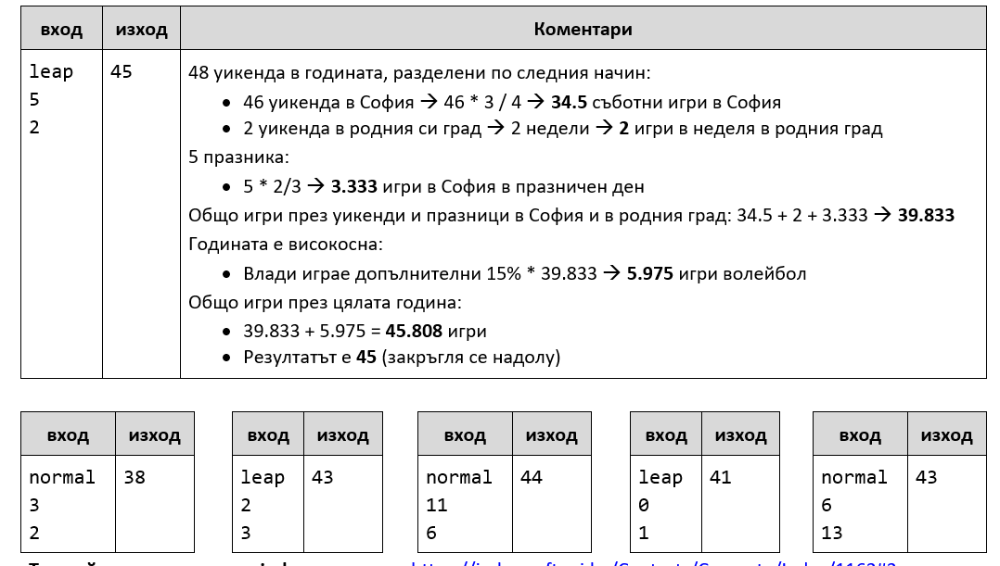

**Тествайте** решението си в **judge системата**:
<https://judge.softuni.bg/Contests/Compete/Index/1162#2>

\* **Подсказки**:

-   Пресметнете **уикендите в София** (48 минус уикендите в родния град).
    Пресметнете **броя игри в уикендите в София**: умножете уикендите в София с
    (3.0 / 4). Обърнете внимание, че трябва да се използва **дробно деление**
    (3.0 / 4), а не целочислено (3 / 4).

-   Пресметнете **броя игри в родния град**. Те са точно колкото са пътуванията
    до родния град.

-   Пресметнете **броя игри в празничен ден**. Те са броя празници умножени по
    (2.0 / 3).

-   **Сумирайте** броя на всички игри. Той е дробно число. Не бързайте да
    закръгляте още.

-   Ако годината е **високосна**, добавете **15%** към общия брой игри.

-   Накрая **закръглете** надолу до най-близкото цяло число с
    **Math.Truncate(result)**.

4.Лятно облекло
--------------

Лято е с много променливо време и Виктор има нужда от вашата помощ. Напишете
програма която **спрямо времето от денонощието и градусите** да препоръча на
Виктор какви дрехи да си облече. Вашия приятел има различни планове за всеки
етап от деня, които изискват и различен външен вид, тях може да видите от
**таблицата.**

**От конзолата се четат точно два реда:**

-   **Градусите - цяло число в интервала [10…42]**

-   **Текст, време от денонощието - с възможности - "Morning", "Afternoon",
    "Evening"**

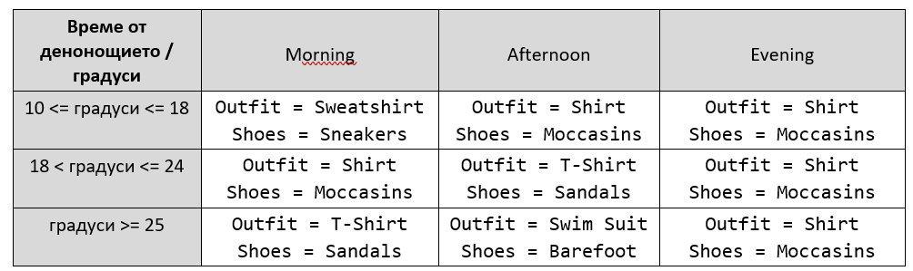

**Да се отпечата на конзолата на един ред: "It's {градуси} degrees, get your
{облекло} and {обувки}."**

### Примерен вход и изход

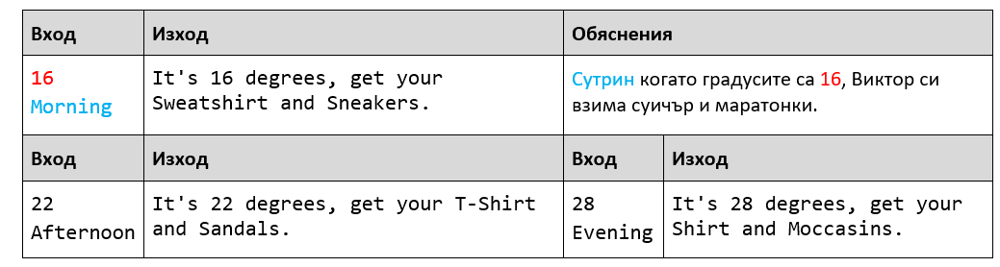

Тествайте решението си в judge системата: <https://judge.softuni.bg/Contests/Compete/Index/1162#3>
--------------------------------------------------------------------------------------------------

5.Нов дом
-------

Марин и Нели си купуват къща не далеч от София. Нели толкова много обича
цветята, че Ви убеждава да **напишете програма** която да **изчисли колко ще им
струва**, да си засадят определен брой цветя и **дали наличния бюджет ще им е
достатъчен. Различните цветя са с различни цени.**

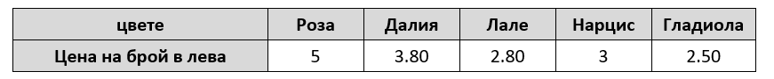

**Съществуват следните отстъпки:**

-   **Ако Нели купи повече от 80 Рози - 10% отстъпка от крайната цена**

-   **Ако Нели купи повече от 90 Далии - 15% отстъпка от крайната цена**

-   **Ако Нели купи повече от 80 Лалета - 15% отстъпка от крайната цена**

-   **Ако Нели купи по-малко от 120 Нарциса - цената се оскъпява с 15%**

-   **Ако Нели Купи по-малко от 80 Гладиоли - цената се оскъпява с 20%**

**От конзолата се четат 3 реда:**

-   **Вид цветя - текст с възможности - "Roses", "Dahlias", "Tulips",
    "Narcissus", "Gladiolus"**

-   **Брой цветя - цяло число в интервала [10…1000]**

-   **Бюджет - цяло число в интервала [50…2500]**

Да се **отпечата** на конзолата **на един ред:**

-   **Ако бюджета им е достатъчен - "Hey, you have a great garden with {броя
    цвета} {вид цветя} and {останалата сума} leva left."**

-   **Ако бюджета им е НЕ достатъчен - "Not enough money, you need {нужната
    сума} leva more."**

**Сумата да бъде форматирана до втория знак след десетичната запетая.**

### Примерен вход и изход

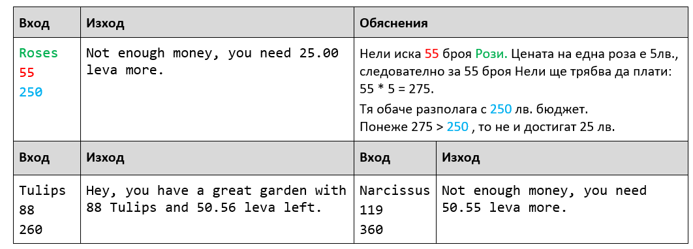

Тествайте решението си в judge системата: <https://judge.softuni.bg/Contests/Compete/Index/1162#4>
--------------------------------------------------------------------------------------------------

6.Лодка за риболов
----------------

Тони и приятели много обичали да ходят за риба, те са толкова запалени по
риболова, че решават да отидат на риболов с кораб. Цената за наема на кораба
зависи от **сезона и броя рибари.**

**Цената зависи от сезона:**

-   **Цената за наем на кораба през пролетта е 3000 лв.**

-   **Цената за наем на кораба през лятото и есента е 4200 лв.**

-   **Цената за наем на кораба през зимата е 2600 лв.**

**В зависимост от броя си групата ползва отстъпка:**

-   **Ако групата е до 6 човека включително – отстъпка от 10%.**

-   **Ако групата е от 7 до 11 човека включително – отстъпка от 15%.**

-   **Ако групата е от 12 нагоре – отстъпка от 25%.**

Рибарите ползват допълнително **5% отстъпка ако са четен брой освен ако не е
есен - тогава нямат допълнителна отстъпка.**

**Напишете програма**, която да **пресмята** дали рибарите ще **съберат
достатъчно пари.**

Вход
----

**От конзолата се четат точно три реда.**

-   **Бюджет на групата – цяло число в интервала [1…8000]**

-   **Сезон – текст : "Spring", "Summer", "Autumn", "Winter"**

-   **Брой рибари – цяло число в интервала [4…18]**

Изход
-----

Да се **отпечата** на конзолата **един ред**:

-   Ако **бюджетът е достатъчен:**

    "**Yes! You have {останалите пари} leva left.**"

-   Ако **бюджетът НЕ Е достатъчен**:

    "**Not enough money! You need {сумата**, **която не достига} leva.**"

**Сумите** трябва да са **форматирани с точност до два знака след десетичната
запетая**.

### Примерен вход и изход

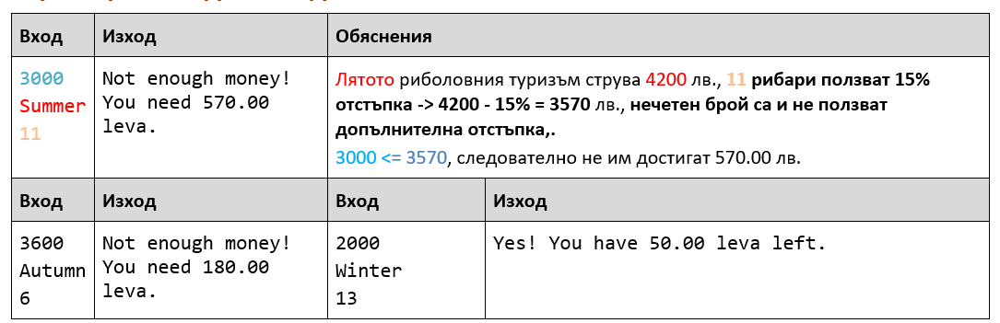

Тествайте решението си в judge системата: <https://judge.softuni.bg/Contests/Compete/Index/1162#5>
--------------------------------------------------------------------------------------------------

Примерни изпитни задачи
=======================

7.Навреме за изпит
----------------

Тествайте решението си [тук](https://judge.softuni.bg/Contests/Compete/Index/1162#6)*.*
---------------------------------------------------------------------------------------

Студент трябва да отиде **на изпит в определен час** (например в 9:30 часа). Той
идва в изпитната зала в даден **час на пристигане** (например 9:40). Счита се,
че студентът е дошъл **навреме**, ако е пристигнал в часа на изпита или до
половин час преди това. Ако е пристигнал по-рано повече от 30 минути, той е
**подранил**. Ако е дошъл след часа на изпита, той е **закъснял**. Напишете
програма, която прочита време на изпит и време на пристигане и отпечатва дали
студентът е дошъл **навреме**, дали е **подранил** или е **закъснял** и **с
колко часа или минути** е подранил или закъснял.

### Вход

От конзолата се четат **4 цели числа** (по едно на ред), въведени от
потребителя:

-   Първият ред съдържа **час на изпита** – цяло число от 0 до 23.

-   Вторият ред съдържа **минута на изпита** – цяло число от 0 до 59.

-   Третият ред съдържа **час на пристигане** – цяло число от 0 до 23.

-   Четвъртият ред съдържа **минута на пристигане** – цяло число от 0 до 59.

### Изход

На първият ред отпечатайте:

-   “**Late**”, ако студентът пристига по-късно от часа на изпита.

-   “**On time**”, ако студентът пристига точно в часа на изпита или до 30
    минути по-рано.

-   “**Early**”, ако студентът пристига повече от 30 минути преди часа на
    изпита.

Ако студентът пристига с поне минута разлика от часа на изпита, отпечатайте на
следващия ред:

-   “**mm minutes before the start**” за идване по-рано с по-малко от час.

-   “**hh:mm hours before the start**” за подраняване с 1 час или повече.
    Минутите винаги печатайте с 2 цифри, например “1:05”.

-   “**mm minutes after the start**” за закъснение под час.

-   “**hh:mm hours after the start**” за закъснение от 1 час или повече.
    Минутите винаги печатайте с 2 цифри, например “1:03”.

### Примерен вход и изход

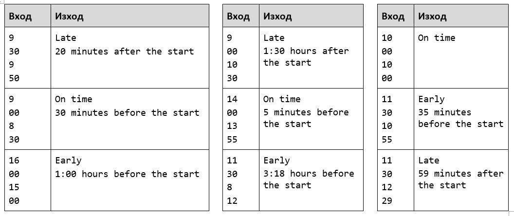

8.Пътешествие
-----------

Тествайте решението си [тук](https://judge.softuni.bg/Contests/Compete/Index/1162#7)*.*
---------------------------------------------------------------------------------------

Странно, но повечето хора си плануват от рано почивката. Млад програмист
разполага с **определен бюджет** и свободно време в даден **сезон**. Напишете
програма, която да приема **на входа бюджета и сезона**, а **на изхода** да
изкарва, **къде ще почива** програмиста и **колко ще похарчи**.

**Бюджета определя дестинацията, а сезона определя колко от бюджета ще
изхарчи**. Ако е **лято** ще почива на **къмпинг**, а **зимата в хотел**. Ако е
в **Европа**, **независимо от сезона** ще почива в **хотел**. Всеки **къмпинг**
или **хотел**, **според дестинацията**, има **собствена цена** която отговаря на
даден **процент от бюджета**:

-   При **100лв. или по-малко** – някъде в **България**

    -   **Лято** – **30%** от бюджета

    -   **Зима** – **70%** от бюджета

-   При **1000лв. или по малко** – някъде на **Балканите**

    -   **Лято** – **40%** от бюджета

    -   **Зима** – **80%** от бюджета

-   При **повече от 1000лв**. – някъде из **Европа**

    -   При пътуване из Европа, независимо от сезона ще похарчи **90% от
        бюджета**.

### Вход

Входът се чете от конзолата и се състои от **два реда**, въведени от
потребителя:

-   **Първи ред** – Бюджет, **реално число** в интервала **[10.00...5000.00].**

-   **Втори ред** – Един от двата възможни сезона: **„summer”** или **“winter”**

### Изход

На конзолата трябва да се отпечатат **два реда**.

-   **Първи ред** – „**Somewhere in [дестинация]**“ измежду
    “**Bulgaria**”,”**Balkans**” и ”**Europe**”

-   **Втори ред** – “{**Вид почивка**} – {**Похарчена сума**}“

    -   **Почивката** може да е между „**Camp**” и „**Hotel**”

    -   **Сумата** трябва да е **закръглена с точност до вторият знак след
        запетаята**.

### Примерен вход и изход

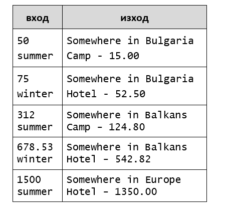

9.Операции между числа
--------------------

Тествайте решението си [тук](https://judge.softuni.bg/Contests/Compete/Index/1162#8)*.*
---------------------------------------------------------------------------------------

Напишете програма, която чете **две цели числа (N1 и N2)** и **оператор,** с
който да се **извърши** дадена **математическа операция** с тях. Възможните
операции са: **Събиране(+)**, **Изваждане(-)**, **Умножение(\*)**,
**Деление(/)** и **Модулно деление(%).** При **събиране**, **изваждане** и
**умножение** на конзолата **трябва да се отпечатат резултата** и дали той е
**четен** или **нечетен**. При **обикновеното деление** – **резултат**а. При
**модулното деление** – **остатъка**. Трябва да се има предвид, че **делителят
може да е равен на 0(нула)**, а **на нула не се дели**. В този случай трябва да
се отпечата **специално съобщениe**.

### Вход

От конзолата се прочитат **3 реда**, въведени от потребителя:

-   **N1** – **цяло число** в интервала **[0...40 000]**

-   **N2** – **цяло число** в интервала **[0...40 000]**

-   **Оператор** – **един символ** измеду: „**+**“, „**-**“, „**\***“, „**/**“,
    „**%**“

### Изход

Да се отпечата на конзолата **един ред**:

-   Ако операцията е **събиране**, **изваждене** или **умножение**:

    -   **„{N1} {оператор} {N2} = {резултат} – {even/odd}“**

-   Ако операцията е **деление**:

    -   **„{N1} / {N2} = {резултат}“** – резултатът е **фораматиран** до
        **вторият знак след дес.запетая**

-   Ако операцията е **модулно деление**:

    -   **„{N1} % {N2} = {остатък}“**

-   В случай на **деление с 0(нула)**:

    -   **„Cannot divide {N1} by zero“**

### Примерен вход и изход

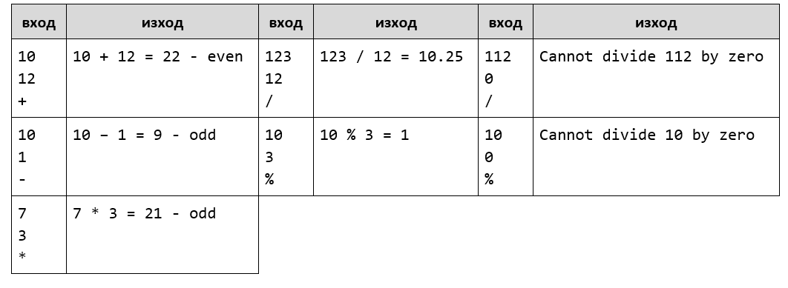

10.Хотелска стая
-------------

Тествайте решението си [тук](https://judge.softuni.bg/Contests/Compete/Index/1162#9)*.*
---------------------------------------------------------------------------------------

Хотел предлага **2 вида стаи**: **студио и апартамент**. Напишете програма,
която изчислява **цената за целия престой за студио и апартамент**. **Цените**
зависят от **месеца** на престоя:

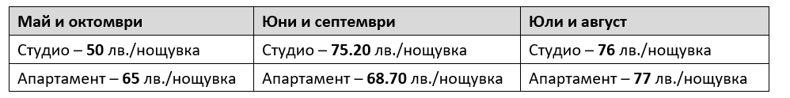

Предлагат се и следните **отстъпки**:

-   За **студио**, при **повече** от **7** нощувки през **май и октомври** :
    **5% намаление**.

-   За **студио**, при **повече** от **14** нощувки през **май и октомври** :
    **30% намаление**.

-   За **студио**, при **повече** от **14** нощувки през **юни и септември**:
    **20% намаление**.

-   За **апартамент**, при **повече** от **14** нощувки**, без значение от
    месеца : 10% намаление.**

### Вход

Входът се чете от **конзолата** и съдържа **точно 2 реда**, въведени от
потребителя:

-   На **първия** ред е **месецът** – **May, June, July, August, September** или
    **October**

-   На **втория** ред е **броят на нощувките** – **цяло число в интервала [0 ...
    200]**

### Изход

Да се **отпечатат** на конзолата **2 реда**:

-   На **първия ред**: “**Apartment: {цена за целият престой} lv.**”

-   На **втория ред**: “**Studio: {цена за целият престой} lv.**“

**Цената за целия престой форматирана с точност до два знака след десетичната
запетая**.

### Примерен вход и изход

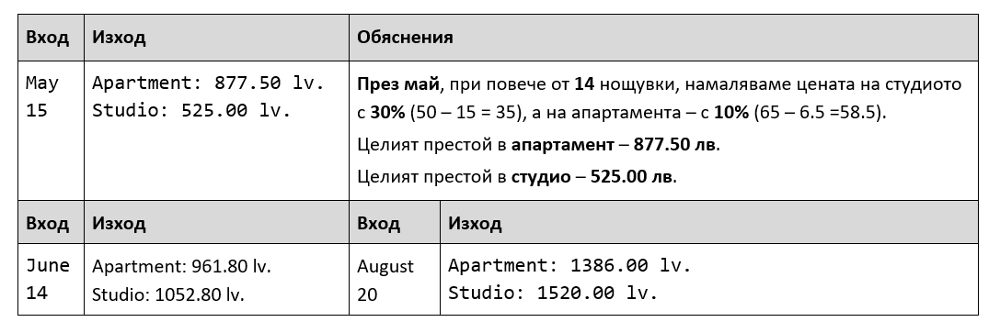
