Лаб: Вложени условни конструкции
================================

Задачи за упражнение в клас и за домашно към курса ["Основи на програмирането"
\@ СофтУни](https://softuni.bg/courses/programming-basics).

1.Обръщение според възраст и пол
------------------------------

Да се напише **конзолна програма**, която **прочита възраст** (реално число) и
**пол** ('**m**' или '**f**'), въведени от потребителя, и отпечатва
**обръщение** измежду следните:

-   "**Mr.**" – мъж (пол '**m**') на 16 или повече години

-   "**Master**" – момче (пол '**m**') под 16 години

-   "**Ms.**" – жена (пол '**f**') на 16 или повече години

-   "**Miss**" – момиче (пол '**f**') под 16 години

### Примерен вход и изход

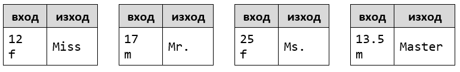

2.Квартално магазинче
-------------------

Предприемчив българин отваря **квартални магазинчета** в **няколко града** и
продава на **различни цени според града**:

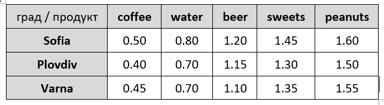

Напишете програма, която чете **продукт** (низ), **град** (низ) и **количество**
(десетично число), въведени от потребителя, и пресмята и отпечатва **колко
струва** съответното количество от избрания продукт в посочения град.

### Примерен вход и изход

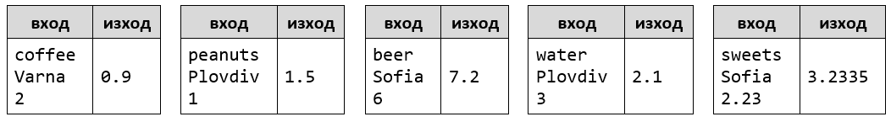

3.Точка в правоъгълник
--------------------

Напишете програма, която проверява дали **точка {x, y}** се намира **вътре в
правоъгълник {x1, y1} – {x2, y2}**. Входните данни се четат от конзолата и се
състоят от 6 реда, въведени от потребителя: десетичните числа **x1**, **y1**,
**x2**, **y2**, **x** и **y** (като се гарантира, че **x1 \< x2** и **y1 \<
y2**). Една точка е вътрешна за даден правоъгълник, ако се намира някъде във
вътрешността му или върху някоя от страните му. Отпечатайте “**Inside**” или
“**Outside**”.

### Примерен вход и изход:

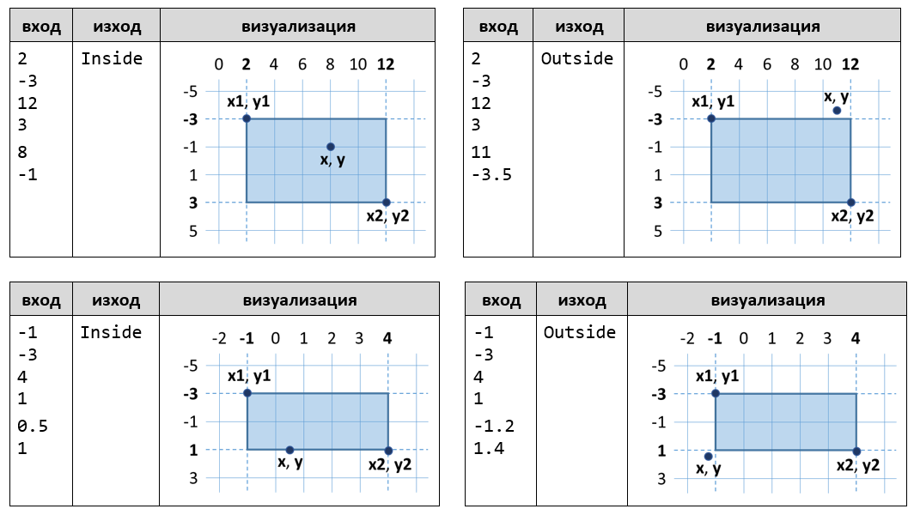

**Тествайте** решението си в **judge системата**:
<https://judge.softuni.bg/Contests/Compete/Index/1013#2>

\* **Подсказка**: една точка е вътрешна за даден многоъгълник, ако едновременно
са изпълнени следните четири условия (можете да ги проверите с **if** проверка с
логическо "**и**" – оператор **&&**):

-   Точката е надясно от лявата стена на правоъгълника (**x \>= x1**)

-   Точката е наляво от дясната стена на правоъгълника (**x \<= x2**)

-   Точката е надолу от горната стена на правоъгълника (**y \>= y1**)

-   Точката е нагоре от долната стена на правоъгълника (**y \<= y2**)

4.Плод или зеленчук?
------------------

Да се напише програма, която **чете име на продукт**, въведено от потребителя, и
проверява дали е **плод** или **зеленчук**.

-   Плодовете "**fruit**" имат следните въможни стойности: **banana**,
    **apple**, **kiwi**, **cherry**, **lemon** и **grapes**

-   Зеленчуците "**vegetable**" имат следните въможни стойности: **tomato**,
    **cucumber**, **pepper** и **carrot**

-   Всички останали са "**unknown**"

Да се изведе "**fruit**”, "**vegetable**" или "**unknown**" според въведения
продукт.

### Примерен вход и изход

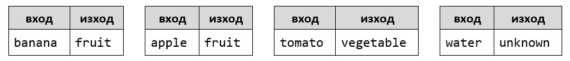

**Тествайте** решението си в **judge системата**:
<https://judge.softuni.bg/Contests/Compete/Index/1013#3>

\* **Подсказка**: използвайте условна **if** проверка с логическо "**или**" –
operator **\|\|**.

5.Невалидно число
---------------

Дадено **число е валидно**, ако е в диапазона [**100**…**200**] или е **0**. Да
се напише програма, която **чете цяло число**, въведено от потребителя, и печата
"**invalid**" ако въведеното число **не е валидно**.

### Примерен вход и изход

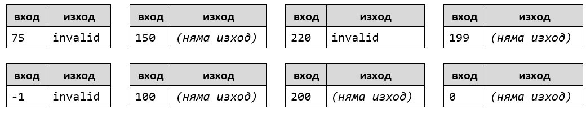

**Тествайте** решението си в **judge системата**:
https://judge.softuni.bg/Contests/Practice/Index/1013\#4

\* **Подсказка**: използвайте условна **if** проверка с **отрицание** и
логически операции.

6.Магазин за плодове
------------------

Магазин за плодове през **работните дни** работи на следните **цени**:

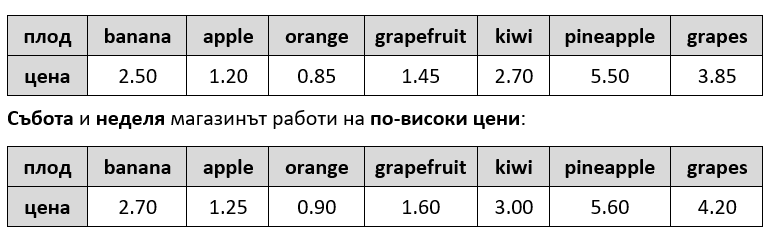

Напишете програма, която чете от конзолата **плод** (banana / apple / orange /
grapefruit / kiwi / pineapple / grapes), **ден от седмицата** (Monday / Tuesday
/ Wednesday / Thursday / Friday / Saturday / Sunday) и **количество** (реално
число) , въведени от потребителя, и пресмята **цената** според цените от
таблиците по-горе. Резултатът да се отпечата **закръглен с 2 цифри** след
десетичната точка. При невалиден ден от седмицата или невалидно име на плод да
се отпечата "**error**".

### Примерен вход и изход

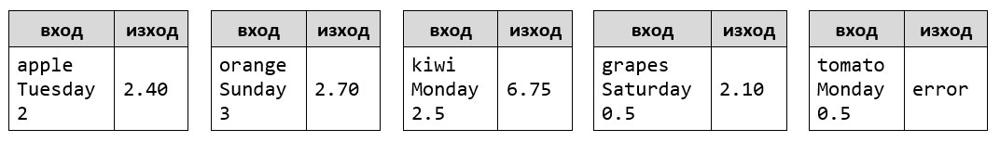

**Тествайте** решението си в **judge системата**:
<https://judge.softuni.bg/Contests/Compete/Index/1013#5>

7.Търговски комисионни
--------------------

Фирма дава следните **комисионни** на търговците си според **града**, в който
работят и обема на **продажбите**:

Напишете **конзолна програма**, която чете име на **град** (стринг) и обем на
**продажби** (реално число) , въведени от потребителя, и изчислява и извежда
размера на търговската **комисионна** според горната таблица. Резултатът да се
изведе закръглен с **2 цифри след десетичната точка**. При **невалиден** град
или обем на продажбите (отрицателно число) да се отпечата "**error**".

### Примерен вход и изход

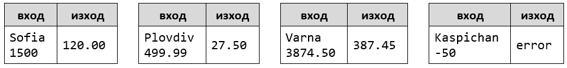

**Тествайте** решението си в **judge системата**:
<https://judge.softuni.bg/Contests/Compete/Index/1013#6>

8.Ден от седмицата
----------------

Напишете програма, която чете **цяло число**, въведено от потребителя, и
отпечатва **ден от седмицата** (на английски език), в граници [1...7] или
отпечатва "**Error**" в случай, че въведеното число е **невалидно**.

### Примерен вход и изход:

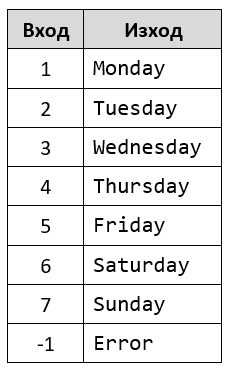

**\*Подсказка:** Използвайте условната конструкция
[switch-case](https://developer.mozilla.org/en-US/docs/Web/JavaScript/Reference/Statements/switch).

**Тествайте** решението си в **judge системата**:
<https://judge.softuni.bg/Contests/Compete/Index/1013#7>

9.Клас животно
------------

Напишете програма, която отпечатва класа на животното според неговото име,
въведено от потребителя.

-   **dog -\> mammal**

-   **crocodile, tortoise, snake -\> reptile**

-   **others -\> unknown**

### Примерен вход и изход

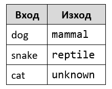

**\*Подсказка:** Използвайте условната конструкция **switch-case**.

**Тествайте** решението си в **judge системата**:
<https://judge.softuni.bg/Contests/Compete/Index/1013#8>

Примерна изпитна задача
=======================

\* 10.Билети за мач
----------------

**Тествайте** решението си
[тук](https://judge.softuni.bg/Contests/Compete/Index/1013#9).

Когато пуснали **билетите за Евро 2016**, **група** запалянковци **решили да си
закупят**. **Билетите** имат **две категории с различни цени**:

-   **VIP** – **499.99** лева.

-   **Normal** – **249.99** лева.

Запалянковците **имат определен бюджет**, a **броят на хората** в групата
**определя какъв процент от бюджета** трябва **да се задели за транспорт**:

-   **От 1 до 4** – **75% от бюджета**.

-   **От 5 до 9** – **60% от бюджета**.

-   **От 10 до 24** – **50% от бюджета**.

-   **От 25 до 49** – **40% от бюджета**.

-   **50 или повече** – **25% от бюджета**.

**Напишете програма**, която да **пресмята дали с останалите пари от бюджета**
могат да си **купят билети за избраната категория**. И **колко пари** ще им
**останат или ще са им нужни**.

### Вход

Програмата чете **точно 3 реда** , въведени от потребителя:

-   На **първия** ред е **бюджетът** – **реално число в интервала [1 000.00 ...
    1 000 000.00]**

-   На **втория** ред е **категорията** – текст с възможности "**VIP**" или
    "**Normal**"

-   На **третия** ред е **броят на хората в групата** – **цяло число в интервала
    [1 ... 200]**

### Изход

Да се **отпечата** на конзолата **един ред**:

-   Ако **бюджетът е достатъчен**:

    -   "**Yes! You have {N} leva left.**"– **N са останалите пари** на групата

-   Ако **бюджетът НЕ Е достатъчен**:

    -   "**Not enough money! You need {М} leva.**" – където **М е сумата, която
        не достига**

**Сумите** трябва да са **форматирани с точност до два знака след десетичната
запетая**.

### Примерен вход и изход

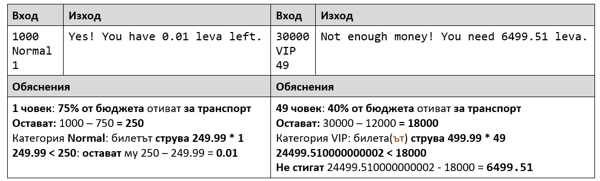
