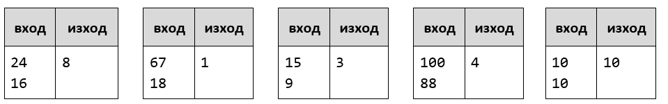
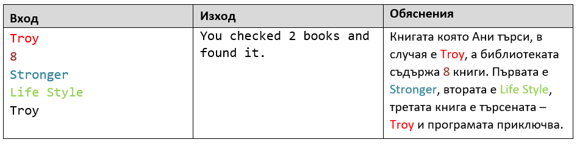
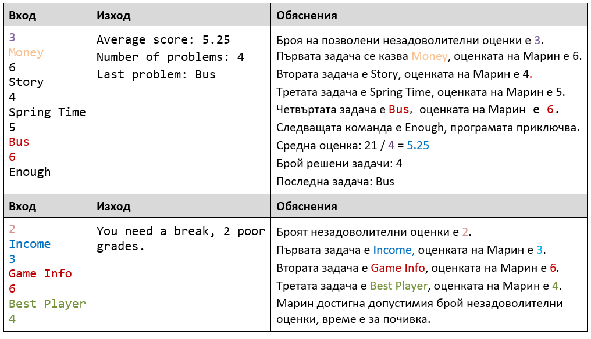
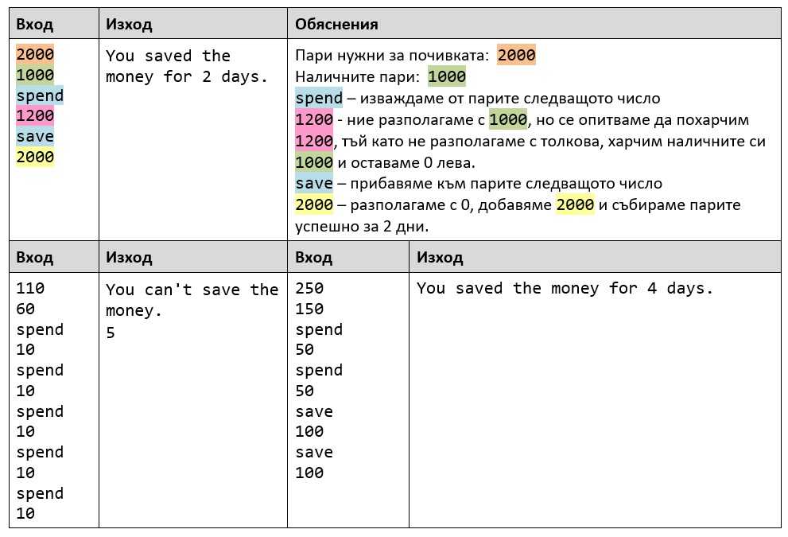
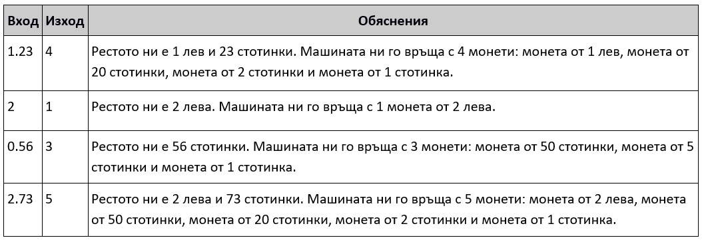
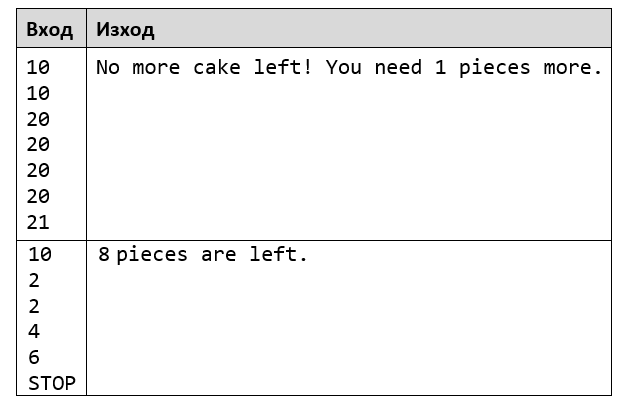

### Упражнение: Повторения с цикли – while-цикъл

Задачи за упражнение и домашно към курса ["Основи на програмирането" в
СофтУни](https://softuni.bg/courses/programming-basics).

1.Най-голям общ делител
-----------------------

Напишете програма, която чете две цели положителни числа **a** и **b**, въведени
от потребителя, и изчислява и отпечатва **най-големият им общ делител (НОД)**.

### Примерен вход и изход

**Тествайте** решението си в **judge системата**:
<https://judge.softuni.bg/Contests/Compete/Index/1163#0>

**Подсказка**: имплементирайте **алгоритъма на Евклид**:
[https://bg.wikipedia.org/wiki/алгоритъм-на-Евклид](https://bg.wikipedia.org/wiki/%D0%90%D0%BB%D0%B3%D0%BE%D1%80%D0%B8%D1%82%D1%8A%D0%BC_%D0%BD%D0%B0_%D0%95%D0%B2%D0%BA%D0%BB%D0%B8%D0%B4).

2.Старата библиотека
--------------------

Ани отива до родния си град след много дълъг период на гурбет в Чужбина.
Прибирайки се вкъщи тя вижда старата библиотека на баба си и си спомня за
любимата си книга. Помогнете на Ани, като напишете програма в която тя въвежда
търсената от нея **книга**(**текст**) и **капацитета на библиотеката**(**цяло
число**). **Докато Ани не намери любимата си книга или не достигне капацитета на
библиотеката, четете всеки път на нов ред името на всяка следваща книга
(текст).**

-   **Ако не открие книгата да се отпечата на два реда:**

-   **“The book you search is not here!”**

-   **“You checked {брой} books.**

-   **Ако открие книгата си се отпечатва един ред:**

    -   **“You checked {брой} books and found it.”**

### Примерен вход и изход

3.Подготовка за изпит
---------------------

*Тествайте решението си*
[тук](https://judge.softuni.bg/Contests/Compete/Index/1163#2)*.*

Напишете програма, в която Марин решава задачи от изпити **докато не получи**
съобщение **"Enough"** от лектора си. При всяка решена задача той получава
оценка.  
**Незадоволителна е всяка оценка, която е по-малка или равна на 4.**

### Вход

-   **На първи ред - брой незадоволителни оценки - цяло число в интервала
    [1…5]**

-   **След това многократно се четат по два реда:**

    -   **Име на задача - текст (стринг)**

-   **Оценка - цяло число в интервала [2…6]**

**Програмата трябва да приключи прочитането на данни при команда "Enough" или
ако Марин получи определеният брой незадоволителни оценки.**

Изход
=====

-   Ако Марин стигне до командата **"Enough", отпечатайте на 3 реда:**

-   **"Average score: {средна оценка}"**

-   **"Number of problems: {броя на всички задачи}"**

    -   **"Last problem: {името на последната задача}"**

-   **Ако получи определеният брой незадоволителни оценки:**

-   **"You need a break, {брой незадоволителни оценки} poor grades."**

**Средната оценка да бъде форматирана до втория знак след десетичната запетая.**

### Примерен вход и изход

4.Почивка
---------

*Тествайте решението си*
[тук](https://judge.softuni.bg/Contests/Compete/Index/1163#3)*.*

Джеси е решила да събира пари за екскурзия и иска от вас да ѝ помогнете да
разбере **дали ще успее да събере необходимата сума**. Като всеки нормален
човек, **Джеси спестява** или **харчи част от парите** си **всеки ден**. Ако
Джеси иска да **похарчи повече от наличните си пари**, то тя ще похарчи
**всичките и ще ѝ останат 0 лева**.

### Вход

От конзолата се четат:

-   **Пари нужни за екскурзията** - **реално число в интервала [1.00..
    .25000.00]**

-   **Налични пари** - **реално число в интервала [0.00... 25000.00]**

-   **След това многократно се четат по два реда:**

-   **Вид действие – текст с възможности "spend" и "save".**

    -   **Сумата, която ще спести/похарчи - реално число в интервала [0.01…
        25000.00]**

Изход
=====

Програмата трябва да приключи при следните случаи:

-   Ако **5 последователни дни** Джеси **само харчи, на конзолата да се
    изпише:**

-   **"You can't save the money."**

-   **"{Общ брой изминали дни}"**

-   **Ако Джеси събере парите за почивката** на **конзолата се изписва:**

-   **"You saved the money for {общ брой изминали дни} days."**

### Примерен вход и изход

Примерни изпитни задачи
=======================

5.Монети
--------

*Тествайте решението си*
[тук](https://judge.softuni.bg/Contests/Compete/Index/1163#4)*.*

Производителите на вендинг машини искали да направят машините си да връщат
възможно **най-малко монети ресто**. Напишете програма, която приема **сума** -
**рестото**, което трябва да се върне и изчислява **с колко най-малко монети
може да стане това**.

### Примерен вход и изход

6.Торта
-------

*Тествайте решението си*
[тук](https://judge.softuni.bg/Contests/Compete/Index/1163#5)*.*

Поканени сте на 30-ти рожден ден, на който рожденикът черпи с огромна торта. Той
обаче не знае **колко парчета могат да си вземат гостите от нея**. Вашата задача
е да напишете програма, която изчислява **броя на парчетата**, които гостите са
взели, преди тя да свърши. Ще получите **размерите на тортата** (широчина и
дължина – **цели числа** в интервала [1...1000]) и след това на всеки ред, до
получаване на командата "**STOP**" или **докато не свърши тортата**, броят на
парчетата, които гостите вземат от нея.

Да се **отпечата** на конзолата **един** от следните редове:

-   **"{брой парчета} pieces are left."** - ако стигнете до **STOP** и не са
    свършили парчетата торта

-   **"No more cake left! You need {брой недостигащи парчета} pieces more."**

### Примерен вход и изход

