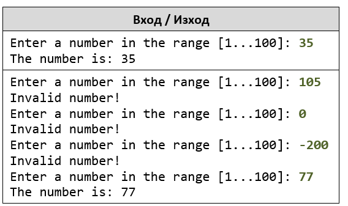
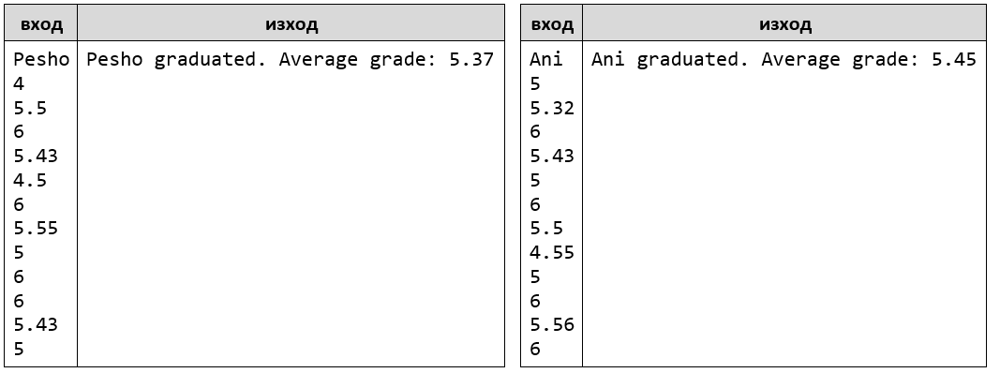
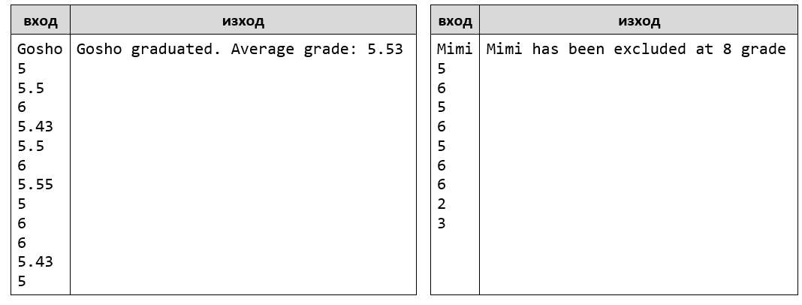
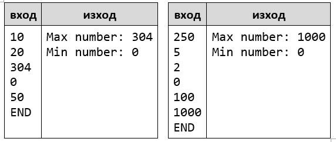
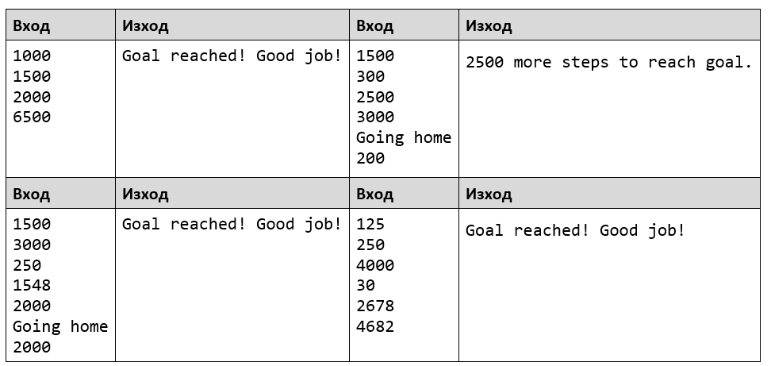
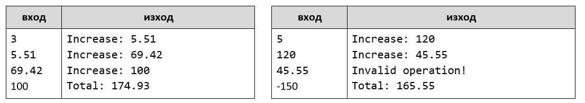
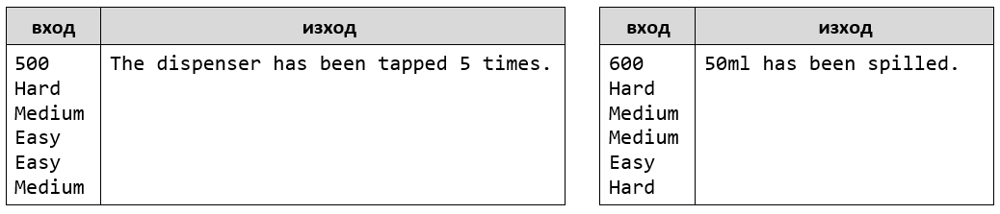
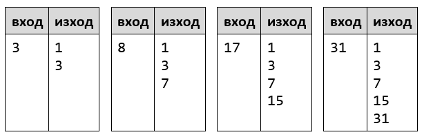
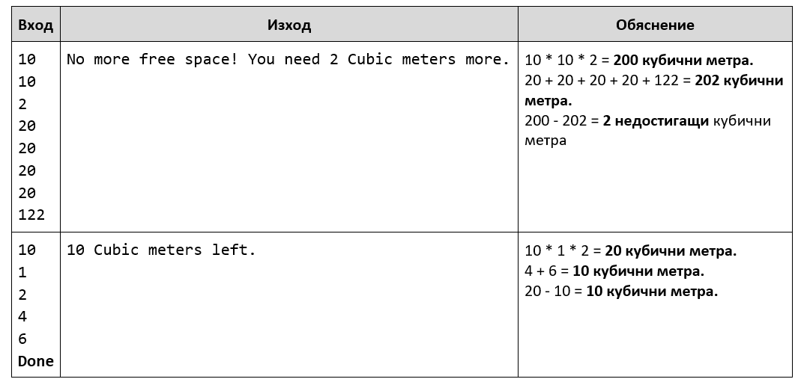

Лаб: Повторения с цикли – while-цикъл
=====================================

Задачи за упражнение и домашно към курса ["Основи на програмирането" в
СофтУни](https://softuni.bg/courses/programming-basics).

1.Число в диапазона [1…100] 
--------------------------

Напишете програма, която въвежда цяло положително **число** n **в диапазона
[1…100]**. При въвеждане на число извън посочения диапазон, да се отпечата
съобщение за грешка и потребителят да се подкани **да въведе ново число**.

### Примерен вход и изход

2.Завършване
----------

Напишете програма, която изчислява **средната оценка** на ученик от цялото му
обучение. На първия ред ще получите **името на ученика**, а на всеки следващ ред
неговите годишни оценки. Ученикът преминава в следващия клас, **ако годишната му
оценка е по-голяма или равна на 4.00**. **Ако оценката му е под 4.00**, той ще
повтори класа.

При успешно завършване на **12-ти** клас да се отпечата:

"**{име на ученика} graduated. Average grade: {средната оценка от цялото
обучение}**"

**Стойността трябва да бъде форматирана до втория знак** след десетичната
запетая.

### Примерен вход и изход

3.Завършване - част 2
-------------------

Напишете програма, която изчислява **средната оценка** на ученик от цялото му
обучение. На първия ред ще получите **името на ученика**, а на всеки следващ ред
неговите годишни оценки. Ученикът преминава в следващия клас, **ако годишната му
оценка е по-голяма или равна на 4.00**. **Ако ученикът бъде скъсан повече от
един път, то той бива изключен и програмата приключва,** като се отпечатва
**името на ученика и в кой клас бива изключен**.

При успешно завършване на **12-ти** клас да се отпечата :

"**{име на ученика} graduated. Average grade: {средната оценка от цялото
обучение}**"

**В случай, че ученикът е изключен от училище,** да се отпечата**:**

"**{име на ученика} has been excluded at {класа, в който е бил изключен}
grade**"

**Стойността трябва да бъде форматирана до втория знак** след десетичната
запетая.

### Примерен вход и изход

**Тествайте** решението си в **judge системата**:
<https://judge.softuni.bg/Contests/Compete/Index/1014#2>

### Насоки:

-   Използвайте решението от предната задача и добавете нужната функционалност

4.Редица цели числа
-----------------

Напишете програма, която чете **цели числа**, **докато** не получи командата
**"END"**. Принтирайте **най-голямото** и **най-малкото** число сред въведените.

### Примерен вход и изход

**Тествайте** решението си в **judge системата**:
<https://judge.softuni.bg/Contests/Compete/Index/1014#3>

5.Стъпки
------

Габи иска да започне здравословен начин на живот и си е поставила за цел да
върви **10 000 стъпки всеки ден**. Някои дни обаче е много уморена от работа и
ще иска да се прибере преди да постигне целта си. Напишете програма, която
**чете от конзолата по колко стъпки изминава** тя всеки път като излиза през
деня и **когато постигне целта си да се изписва** "**Goal reached! Good job!**"

Ако иска да се **прибере преди това**, тя ще въведе **командата** "**Going
home**" и **ще въведе стъпките, които е извървяла докато се прибира**. След
което, ако не е успяла да постигне целта си, на конзолата трябва да се изпише:
"**{разликата между стъпките} more steps to reach goal.**"

### Примерен вход и изход

**Тествайте** решението си в **judge системата**:
<https://judge.softuni.bg/Contests/Compete/Index/1014#4>

6.Баланс по сметка
----------------

Напишете програма, която пресмята колко общо пари има в сметката, след като
направите определен брой вноски. На първия ред ще получите **колко вноски трябва
да се направят**. На всеки следващ ред ще получавате сумата, която трябва да
внесете в сметката, **докато не се достигне броя вноски**. При всяка получена
сума на конзолата трябва да се извежда **"Increase: "** + сумата и тя да се
**прибавя в сметката**. Ако получите число **по-малко от 0** на конзолата трябва
да се изведе **"Invalid operation!"** и **програмата да приключи**. Когато
програмата приключи трябва да се принтира **"Total: "** + общата сума в сметката
закръглена до втория знак след десетичната запетая.

### Примерен вход и изход

**Тествайте** решението си в **judge системата**:
<https://judge.softuni.bg/Contests/Compete/Index/1014#5>

7.Чаша с вода
--------------

Всеки офис си има диспенсър за вода. Напишете програма, която отчита дали
служител от офиса е успял да напълни чашата си успешно.

Диспенсърът има три бутона :

-   **Easy - лесен (50 милилитра)**

-   **Medium - среден (100 милилитра)**

-   **Hard - силен (200 милилитра)**

Ще получите **обемът на чашата** и на всеки следващ ред **кой бутон е бил
натиснат**. **Ако чашата се напълни или прелее програмата приключва.**

Ако чашата прелее отпечатайте **колко вода е била излята**. При успешно
напълване отпечатайте **броят на натисканията на бутона**.

### Примерен вход и изход

**Тествайте** решението си в **judge системата**:
<https://judge.softuni.bg/Contests/Compete/Index/1014#6>

8.Редица числа 2k+1
-----------------

Напишете програма, която чете число **n**, въведено от потребителя, и отпечатва
**всички числа ≤ n от редицата**: 1, 3, 7, 15, 31, …. Всяко следващо число се
изчислява като умножим **предишното** с **2** и добавим **1**.

### Примерен вход и изход

**Тествайте** решението си в **judge системата**:
<https://judge.softuni.bg/Contests/Compete/Index/1014#7>

**Подсказки**:

-   Започнете от **num** = **1**.

-   В цикъл докато **num** не стигне **n**, печатайте, умножавайте по **2** и
    прибавяйте **1**.

Примерна изпитна задача 
========================

\*9.Преместване
-------------

*Тествайте решението си*
[тук](https://judge.softuni.bg/Contests/Compete/Index/1014#8)*.*

На осемнадесетия си рожден ден на Хосе взел решение, че ще се изнесе да живее на
квартира. Опаковал багажа си в **кашони** и намерил подходяща обява за
апартамент под наем. Той започва да пренася своя багаж **на части**, защото не
може да пренесе целия наведнъж. Има ограничено **свободно пространство** в
новото си жилище, където може да разположи вещите, така че мястото да бъде
подходящо за живеене.

Напишете **програма, която изчислява свободния обем от жилището на Хосе, който
остава след като пренесе багажа си.**

**Бележка: Един кашон е с точни размери: 1m. x 1m. x 1m.**

**Вход**

Потребителят въвежда следните данни на отделни редове:

1.  **Широчина на свободното пространство - цяло число в интервала [1...1000]**

2.  **Дължина на свободното пространство - цяло число в интервала [1...1000]**

3.  **Височина на свободното пространство - цяло число в интервала [1...1000]**

4.  На следващите редове **(до получаване на команда "Done") - брой кашони,
    които се пренасят в квартирата - цели числа в интервала [1...10000];**

**Програмата трябва да приключи прочитането на данни при команда "Done" или ако
свободното място свърши.**

**Изход**

Да се **отпечата** на конзолата **един** от следните редове:

-   Ако стигнете до командата **"Done"** и има още свободно място:

>   **"{брой свободни куб. метри} Cubic meters left."**

-   Ако свободното място свърши преди да е дошла команда **"Done":**

>   **"No more free space! You need {брой недостигащи куб. метри} Cubic meters
>   more."**

**Примерен вход и изход**

