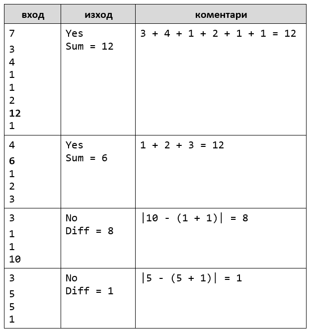

Упражнения: Повторения с цикли – for-цикъл
==========================================

Задачи за упражнение в клас и за домашно към курса ["Основи на програмирането"
\@ СофтУни](https://softuni.bg/courses/programming-basics).

1.Числа до 1000, завършващи на 7
------------------------------

Напишете програма, която отпечатва числата в диапазона **[1…1000]**, които
**завършват на 7**.

**Тествайте** решението си в **judge системата**:
<https://judge.softuni.bg/Contests/Compete/Index/1164#0>

**Подсказка**: можете да завъртите **for**-цикъл от 1 до 1000 и да проверите
всяко число дали завършва на 7. Едно число **num** завършва на 7, когато **(num
% 10 == 7)**.

2.Елемент, равен на сумата на останалите
---------------------------------------

Да се напише програма, която чете **n-на брой** цели числа, въведени от
потребителя, и проверява дали сред тях съществува число, което е равно на сумата
на всички останали. Ако има такъв елемент, печата "**Yes**", "**Sum =** " +
**неговата стойност**; иначе печата "**No**", "**Diff =** " + **разликата между
най-големия елемент и сумата на останалите** (по абсолютна стойност).

### Примерен вход и изход

**Тествайте** решението си в **judge системата**:
<https://judge.softuni.bg/Contests/Compete/Index/1164#1>

**Подсказка**: изчислете **сумата** на всички елементи и **най-големият** от тях
и проверете търсеното условие.

3.Четни / нечетни позиции
-----------------------

Напишете програма, която чете **n-на брой числа**, въведени от потребителя, и
пресмята **сумата**, **минимума** и **максимума** на числата на **четни** и
**нечетни** позиции (броим от 1). Когато няма минимален / максимален елемент,
отпечатайте "**No**".

Изходът да се форматира в следния вид:

"**OddSum=**" + {**сума** на числата на **нечетни** позиции},

"**OddMin=**" + { **минимална** стойност на числата на **нечетни** позиции } /
{“**No**”},

"**OddMax=**" + { **максимална** стойност на числата на **нечетни** позиции } /
{“**No**”},

"**EvenSum=**" + { **сума** на числата на **четни** позиции },

"**EvenMin=**" + { **минимална** стойност на числата на **четни** позиции } /
{“**No**”},

"**EvenMax=**" + { **максимална** стойност на числата на **четни** позиции } /
{“**No**”}

### Примерен вход и изход

**Тествайте** решението си в **judge системата**:
<https://judge.softuni.bg/Contests/Compete/Index/1164#2>

Задача обединява няколко предходни задачи: намиране на **минимум**, намиране на
**максимум**, намиране на **сума** и обработка на елементите от **четни и
нечетни позиции**. Припомнете си ги.

-   Работете с **дробни числа** (не цели). Сумата, минимумът и максимумът също
    са дробни числа.

-   Използвайте **неутрална начална стойност** при намиране на минимум /
    максимум, например **1000000000.0** и **-1000000000.0**. Ако получите накрая
    неутралната стойност, печатайте “**No**”.

4.Еднакви двойки
--------------

Дадени са 2\***n-на брой** числа. Първото и второто формират **двойка**, третото
и четвъртото също и т.н. Всяка двойка има **стойност** – сумата от съставящите я
числа. Напишете програма, която проверява **дали всички двойки имат еднаква
стойност** или печата **максималната разлика** между две последователни двойки.
Ако всички двойки имат еднаква стойност, отпечатайте "**Yes, value={Value}**" +
**стойността**. В противен случай отпечатайте "**No, maxdiff={Difference}**" +
**максималната разлика**.

### Примерен вход и изход

**Тествайте** решението си в **judge системата**:
<https://judge.softuni.bg/Contests/Compete/Index/1164#3>

**Подсказки**:

-   Прочитайте входните числа **по двойки**. За всяка двойка пресмятайте
    **сумата**.

-   Докато четете входните двойки, за всяка двойка без първата пресмятайте
    **разликата с предходната**. За целта пазете в отделна променлива сумата на
    предходната двойка.

-   Намерете **най-голямата разлика** между две двойки. Ако е **0**, печатайте
    “**Yes**” иначе “**No**” + разликата.

Примерни изпитни задачи
=======================

5.Хистограма
----------

*Тествайте решението си*
[тук](https://judge.softuni.bg/Contests/Compete/Index/1164#4)*.*

Дадени са **n** **цели числа** в интервала [**1**…**1000**]. От тях някакъв
процент **p1** са под 200, друг процент **p2** са от 200 до 399, друг процент
**p3** са от 400 до 599, друг процент **p4** са от 600 до 799 и останалите
**p5** процента са от 800 нагоре. Да се напише програма, която изчислява и
отпечатва процентите **p1**, **p2**, **p3**, **p4** и **p5**.

**Пример**: имаме n = **20** числа: 53, 7, 56, 180, 450, 920, 12, 7, 150, 250,
680, 2, 600, 200, 800, 799, 199, 46, 128, 65. Получаваме следното разпределение
и визуализация:

### [./media/image5.png](./media/image5.png)

### Вход

На първия ред от входа стои цялото число **n** (1 ≤ **n** ≤ 1000) – брой числа.
На следващите **n реда** стои **по едно цяло число** в интервала
[**1**…**1000**] – числата върху които да бъде изчислена хистограмата.

### Изход

Да се отпечата на конзолата **хистограмата** – **5 реда**, всеки от които
съдържа число между 0% и 100%, с точност две цифри след десетичната точка,
например 25.00%, 66.67%, 57.14%.

### Примерен вход и изход

[./media/image6.png](./media/image6.png)
----------------------------------------

6.Деление без остатък
-------------------

*Тествайте решението си*
[тук](https://judge.softuni.bg/Contests/Compete/Index/1164#5)*.*

Дадени са **n-на брой** **цели числа** в интервала [**1**…**1000**]. От тях
някакъв **процент p1 се делят без остатък на 2**, друг **процент p2** се **делят
без остатък на 3**, друг **процент p3** се **делят без остатък на 4**. Да се
напише програма, която изчислява и отпечатва процентите **p1**, **p2** и **p3**.

**Пример**: имаме n = **10** числа: 680, 2, 600, 200, 800, 799, 199, 46, 128,
65. Получаваме следното разпределение и визуализация:

### [./media/image7.png](./media/image7.png)

### Вход

На първия ред от входа стои цялото число **n** (1 ≤ **n** ≤ 1000) - брой числа.
На следващите **n реда** стои **по едно цяло число** в интервала
[**1**…**1000**] - числата които да бъдат проверени на колко се делят.

### Изход

Да се отпечатат на конзолата **3 реда**, всеки от които съдържа процент между 0%
и 100%, с точност две цифри след десетичната точка, например 25.00%, 66.67%,
57.14%.

-   На **първият ред** - процентът на числата които **се делят на 2**

-   На **вторият ред** - процентът на числата които **се делят на 3**

-   На **третият ред** - процентът на числата които **се делят на 4**

### Примерен вход и изход

[./media/image8.png](./media/image8.png)
----------------------------------------

7.Заплата
-------

*Тествайте решението си*
[тук](https://judge.softuni.bg/Contests/Compete/Index/1164#6)*.*

Шеф на компания забелязва че все повече служители прекарват време в сайтове,
които ги разсейват.

За да предотврати това, той въвежда изненадващи проверки на отворените табове на
браузъра на служителите си. **Според сайта се налагат различни глоби:**

-   "**Facebook**" **-\> 150 лв.**

-   **"Instagram" -\> 100 лв.**

-   **"Reddit" -\> 50 лв.**

**От конзолата се четат два реда:**

-   **Брой отворени табове в браузъра n - цяло число в интервала [1...10]**

-   **Заплата - число в интервала [700...1500]**

**След това n – на брой пъти се чете име на уебсайт – текст**

Ако по време на проверката заплатата стане **по-малка или равна на 0 лева**, на
конзолата се изписва  
**"You have lost your salary." и програмата приключва.** В противен случай след
проверката **на конзолата се изписва остатъкът** от заплатата (да се изпише
**като цяло число**).

### Примерен вход и изход

