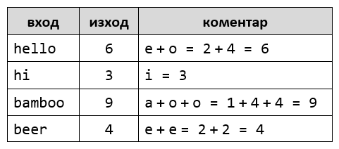

Лаб: Повторения с цикли – for-цикъл
===================================

Задачи за упражнение в клас и за домашно към курса ["Основи на програмирането"
\@ СофтУни](https://softuni.bg/courses/programming-basics).

1.Числа от 1 до 100
-------------------

Напишете програма, която отпечатва числата от 1 до 100, всяко на нов ред.

### Примерен вход и изход

**Тествайте** решението си в **judge системата:**
<https://judge.softuni.bg/Contests/Compete/Index/1015#0>

2.Всички латински букви
-----------------------

Напишете програма, която отпечатва всички букви от латинската азбука: **a**,
**b**, **c**, …, **z**.

**Тествайте** решението си в **judge системата**:
<https://judge.softuni.bg/Contests/Compete/Index/1015#1>

**Подсказка**: можете да завъртите **for**-цикъл от **'a'** до **'z'** (освен
числа може да въртите в цикъл и букви).

3.Сумиране на числа
-------------------

Да се напише програма, която **чете n-**на брой **цели числа**, въведени от
потребителя **и ги сумира**.

-   От първия ред на входа се въвежда броят числа **n**.

-   От следващите **n** реда се въвежда по едно цяло число.

Програмата трябва да прочете числата, да ги сумира и да отпечата сумата им.

### Примерен вход и изход

**Тествайте** решението си в **judge системата**:
<https://judge.softuni.bg/Contests/Compete/Index/1015#2>

**Подсказки**:

-   Първо въведете едно число **n** (броят числа, които предстои да бъдат
    въведени).

-   Инициализирайте **sum = 0** (в началото няма още прочетени числа, и
    съответно сумата е празна).

-   В цикъл **n пъти** прочетете по едно цяло число **num** и го прибавете към
    сумата (**sum = sum + num**).

-   Накрая в **sum** трябва да се е запазила сумата на прочетените числа.
    Отпечатайте я.

4.Най-голямо число
------------------

Напишете програма, която чете **n-на брой цели числа** (**n** \> 0), въведени от
потребителя, и намира **най-голямото** измежду тях. Първо се въвежда броят числа
**n**, а след това самите **n** числа, по едно на ред.

### Примерен вход и изход

**Тествайте** решението си в **judge системата**:
<https://judge.softuni.bg/Contests/Compete/Index/1015#3>

**Подсказки**:

-   Първо въведете едно число **n** (броят числа, които предстои да бъдат
    въведени).

-   Въведете от конзолата първото число. Сложете текущият максимум **max** да е
    прочетеното число.

-   В цикъл **n-1 пъти** прочетете по едно цяло число **num**. Ако прочетеното
    число **num** е по-голямо от текущият максимум **max**, запомнете **num** в
    **max**.

-   Накрая в **max** трябва да се е запазило най-голямото число. Отпечатайте го.

5.Най-малко число
-----------------

Напишете програма, която чете **n-на брой цели числа** (**n** \> 0), въведени от
потребителя и намира **най-малкото** измежду тях. Първо се въвежда броят числа
**n**, а след това самите **n** числа, по едно на ред.

### Примерен вход и изход

**Тествайте** решението си в **judge системата**:
<https://judge.softuni.bg/Contests/Compete/Index/1015#4>

**Подсказки**: задачата е абсолютно аналогична с предходната.

6.Лява и дясна сума
-------------------

Да се напише програма, която чете **2\*n-на брой** цели числа, подадени от
потребителя, и проверява дали **сумата на първите n числа** (лява сума) е равна
на **сумата на вторите n числа** (дясна сума). При равенство печата "**Yes**" +
**сумата**; иначе печата "**No**" + **разликата**. Разликата се изчислява като
положително число (по абсолютна стойност).

### Примерен вход и изход

**Тествайте** решението си в **judge системата**:
<https://judge.softuni.bg/Contests/Compete/Index/1015#5>

**Подсказки**:

-   Въведете **n**.

-   Въведете първите **n** числа (**лявата** половина) и ги сумирайте.

-   Въведете още **n** числа (**дясната** половина) и ги сумирайте.

-   Изчислете **разликата** между сумите по абсолютна стойност:
    **Math.Abs(leftSum - rightSum)**.

-   Ако разликата е **0**, отпечатайте "**Yes**" + **сумата**; иначе отпечатайте
    "**No**" + **разликата**.

7.Четна / нечетна сума
----------------------

Да се напише програма, която чете **n-на брой** цели числа, подадени от
потребителя, и проверява дали **сумата от числата на четни позиции** е равна на
**сумата на числата на нечетни позиции**. При равенство да се отпечата "**Yes**"
+ **сумата**; иначе да се отпечата "**No**" + **разликата**. Разликата се
изчислява по абсолютна стойност.

### Примерен вход и изход

**Тествайте** решението си в **judge системата**:
<https://judge.softuni.bg/Contests/Compete/Index/1015#6>

**Подсказки**: Въведете числата едно по едно и изчислете двете **суми** (числа
на **четни** позиции и числа на **нечетни** позиции). Както в предходната
задача, изчислете абсолютна стойност на разликата и отпечатайте резултата
("**Yes**" + **сумата** при разлика 0 или "**No**" + **разликата** в противен
случай).

8.Сумиране на гласните букви
----------------------------

Да се напише програма, която чете **текст** (стринг), въведен от потребителя, и
изчислява и отпечатва **сумата от стойностите на гласните букви** според
таблицата по-долу:

### Примерен вход и изход

**Тествайте** решението си в **judge системата**:
<https://judge.softuni.bg/Contests/Compete/Index/1015#7>

**Подсказки**:

-   Прочетете входния текст **s**. Нулирайте сумата.

-   Завъртете цикъл от **0** до **s.Length-1** (дължината на текста -1).

-   Проверете всяка буква **s[i]** дали е гласна и съответно добавете към сумата
    стойността й.

**Примерна изпитна задача**

9.Умната Лили
-------------

*Тествайте решението си*
[тук](https://judge.softuni.bg/Contests/Compete/Index/1015#8)

Лили вече е на **N години**. За всеки свой **рожден ден** тя получава подарък.
За **нечетните** рождени дни (**1, 3, 5...n**) получава **играчки**, а за всеки
**четен** (**2, 4, 6...n**) получава **пари**. За **втория рожден ден** получава
**10.00 лв**, като **сумата се увеличава с 10.00 лв, за всеки следващ четен
рожден ден** (**2 -\> 10**, **4 -\> 20**, **6 -\> 30**...и т.н.). През годините
Лили тайно е спестявала парите. **Братът** на Лили, **в годините**, които тя
**получава пари**, **взима по 1.00 лев** от тях. Лили **продала играчките**
получени през годините, **всяка за P лева** и **добавила** сумата **към
спестените пари**. С парите искала да си **купи пералня за X лева**. Напишете
програма, която да пресмята, **колко пари е събрала** и дали ѝ **стигат да си
купи пералня**.

### Вход

Програмата прочита **3 числа**, въведени от потребителя, на отделни редове:

-   **Възрастта** на Лили - **цяло число** в интервала **[1...77]**

-   **Цената на пералнята** - число в интервала **[1.00...10 000.00]**

-   **Единична цена на играчка** - **цяло число** в интервала **[0...40]**

### Изход

Да се отпечата на конзолата един ред:

-   Ако парите на Лили са достатъчни:

    -   **“Yes! {N}”** - където **N** е остатъка пари след покупката

-   Ако парите не са достатъчни:

    -   **“No! {М}“** - където **M** е сумата, която не достига

-   Числата **N** и **M** трябва да за **форматирани до вторият знак след
    десетичната запетая**.

### Примерен вход и изход

