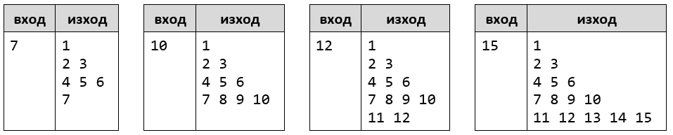
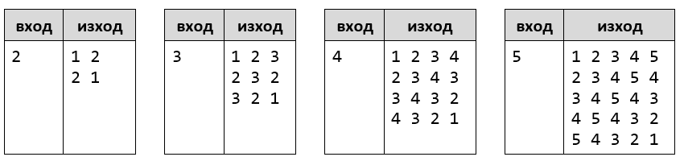

1Упражнения: Вложени цикли
==========================

Задачи за упражнение в клас и за домашно към курса ["Основи на програмирането"
\@ СофтУни](https://softuni.bg/courses/programming-basics).

1.Матрици
-------

Напишете програма, която извежда на конзолата **всички матрици 2х2**, който
удовлетворяват следните **условия**:

-   Елементите на първия ред са **в интервала [a;b],** а елементите на втория
    **в интервала [c;d].**

-   **Сборът на елементите по главния диагонал е равен на сбора на елементите по
    второстепенния**.

-   **На един ред не може да имаме два еднакви елемента**!

От конзолата се прочитат **четири цели числа a,b,c,d** - краищата на
интервалите.

**Тествайте** решението си в **judge системата**:
<https://judge.softuni.bg/Contests/Compete/Index/1165#0>

2.Пирамида от числа
-----------------

Напишете програма, която чете цяло число **n**, въведено от потребителя, и
отпечатва **пирамида от числа** като в примерите:

**Тествайте** решението си в **judge системата**:
<https://judge.softuni.bg/Contests/Compete/Index/1165#1>

**Подсказка**:

-   С **два вложени цикъла** печатайте пирамида от числа: на първия ред едно
    число, на втория ред 2 числа, на третия ред 3 числа и т.н.

-   В отделен **брояч** пазете колко числа сте отпечатали до момента (и кое е
    текущото число). Когато стигнете **n**, излезте внимателно от двата вложени
    цикъла с **break** или **return**.

3.Таблица с числа
---------------

Напишете програма, която чете цяло число **n**, въведено от потребителя, и
отпечатва **таблица (матрица) от числа**.

### Примерен вход и изход:

**Тествайте** решението си в **judge системата**:
<https://judge.softuni.bg/Contests/Compete/Index/1165#2>.

**Подсказка**:

-   С **два вложени цикъла** за **row** (ред) и **col** (колона) печатайте число
    по формулата **num** = **row + col + 1**.

-   За долната дясна половина на таблицата ще се получат грешни резултати. Там
    използвайте формулата **2\*n - num**.

4.Кодиране
--------

Напишете програма, която чете от конзолата **едно цяло число**. На конзолата
трябва да се отпечатат **толкова на брой редове**, колкото **цифрено е
числото**. Като на **първи ред** съответстват **единиците**, на **втори ред
десетиците**, на **трети ред стотиците** от числото и т.н., докато свършат
цифрите от числото. На всеки ред трябва да се отпечата **символ**, който
отговаря на следните условия:

-   символът, който трябва да се отпечата на даден ред се намира от
    [ASCII](http://www.asciitable.com/) таблицата. Неговият **десетичен ASCII
    код** се намира като към цифрата от въведеното число, която съответства на
    даден ред се прибави 33

-   символът се отпечатва **толкова на брой пъти колкото е цифрата**,
    съответстваща за този ред

-   ако за даден ред **съответства цифра 0 на този ред се отпечатва еднократно
    "ZERO"**

5.Еднакви суми на четни и нечетни позиции
---------------------------------------

Напишете програма, която чете от конзолата **две шестцифрени цели числа** в
диапазона от 100000 до 300000. Винаги **първото** въведено число ще бъде **по
малко от второто**. На конзолата да се отпечатат на **1 ред разделени с
интервал** всички числа, които се намират **между двете**, прочетени от
конзолата числа и отговарят на следното **условие**:

-   **сумата** от цифрите на **четни** и **нечетни** позиции да са **равни**.
    Ако няма числа, отговарящи на условието на конзолата не се извежда резултат.

6.Еднакви суми на леви и десни позиции
------------------------------------

Напишете програма, която чете от конзолата **две петцифрени цели числа** в
диапазона от 10000 до 99999. **Първото число** винаги ще бъде **по-малко от
второто**. Да се намерят и отпечатат на конзолата, разделени с интервал, онези
числа, които се намират **между прочетените** от конзолата числа и **отговарят
на следните условия**:

-   **сумите** от **двете най-десни** и **двете най-леви цифри** на
    проверяваното число да са **равни**

-   ако **сумите** са **различни** към **по-малката** от тях се прибавя
    **средната цифра**, на проверяваното число и получената **нова сума** се
    сравнява с **другата сума**. Ако те са равни числото се отпечатва.

**Ако няма числа, отговарящи на условията на конзолата не се извежда резултат.**

7.Суми прости и непрости числа
----------------------------

Напишете програма, която чете от конзолата цели числа в диапазона от
**-2,147,483,648** до **2,147,483,647**, докато не се получи команда "**stop"**.
Да се намери **сумата** на всички въведени **прости** и сумата на всички
въведени **непрости** числа. Тъй като по дефиниция от математиката отрицателните
числа не могат да бъдат прости, ако на входа се подаде **отрицателно** число да
се изведе следното съобщение "**Number is negative.**". В този случай въведено
число се игнорира и не се прибавя към нито една от двете суми, а програмата
продължава своето изпълнение, очаквайки въвеждане на следващо число.

На **изхода** да се отпечатат на два реда **двете намерени суми** в следния
формат:

"Sum of all prime numbers is: {prime numbers sum}"

"Sum of all non prime numbers is: {nonprime numbers sum}"

8.Train the trainers
------------------

Курсът **"**Train the trainers**"** е към края си и финалното оценяване
наближава. Вашата задача е да помогнете на журито което ще оценява
презентациите, като напишете програма в която да изчислява **средната оценка**
от представянето на **всяка една презентация** от даден студент, а накрая
**средният успех от всички тях**.

От конзолата на първият ред се прочита броят на хората в журито **n** - **цяло
число в интервала [1…20]**

След това на отделен ред се прочита името на презентацията - **текст**

За всяка една презентация на нов ред се четат **n - на брой оценки - реално
число в интервала [2.00…6.00]**

**След изчисляване на средната оценка за конкретна презентация,** на конзолата
се печата

**"{името на презентацията} - {средна оценка}."**

След получаване на команда **"Finish"** на конзолата се печата **"Student's
final assessment is {среден успех от всички презентации}."** и програмата
приключва.

Всички оценки трябва да бъдат форматирани до **втория знак** след десетичната
запетая.

\*9.Излет
-------

Времето се затопля, сезона за риболов наближава и всички рибари тръпнат в
очакване. Един от тези рибари е вашият стар познат Любо, който ви моли да му
помогнете като напишете програма, която изчислява с каква **печалба/загуба се
връща от риболовния излет**. **За ВСЯКА трета уловена риба, рибаря не плаща
такса, а получава пари за нея.** Парите, които Любо ще получи или плати за една
риба се образуват от **сумата на ASCII стойността на всеки символ от името на
рибата, разделена на килограмите на рибата.**

### Вход

На **първия ред**, се чете дневната квота (броя риби, които Любо може да хване)
- цяло число [1…100]

След това се четат **многократно по два реда:**

-   името на рибата – **текст**

-   килограмите на рибата – **реално число** в интервала [1.00…1000.00]

### Изход

Риболовът приключва **при получаване на командата "Stop"** или **ако се достигне
дневната квота**.

-   Ако Любо достигне дневната квота първо да се изпише:

    **"Lyubo fulfilled the quota!"**

След **приключване на риболова** на конзолата се печата **един от двата реда**:

-   **Ако Любо е спечелил пари** - **"Lyubo's profit from {брои уловени риби}
    fishes is {спечелени пари} leva."**

-   **Ако Любо е загубил пари – "Lyubo lost {загубени пари} leva today."**

    **Парите да са форматирани до втората цифра след десетичната запетая**.

Примерни изпитни задачи
=======================

10.Генератор за тъпи пароли
------------------------

*Тествайте решението си*
[тук.](https://judge.softuni.bg/Contests/Compete/Index/1165#11)

Да се напише програма, която чете две цели числа *n* и *l*, въведени от
потребителя, и генерира по азбучен ред всички възможни **“тъпи” пароли**, които
се състоят от следните **5 символа**:

-   Символ 1: цифра от **1** до *n*.

-   Символ 2: цифра от **1** до *n*.

-   Символ 3: малка буква измежду първите *l* букви на латинската азбука.

-   Символ 4: малка буква измежду първите *l* букви на латинската азбука.

-   Символ 5: цифра от 1 до **n**, по-голяма от първите 2 цифри.

### Вход

Входът се чете от конзолата и се състои от две **цели числа** *n* и *l* в
интервала [**1**…**9**], по едно на ред.

### Изход

На конзолата трябва да се отпечатат **всички “тъпи” пароли** по **азбучен ред**,
разделени с **интервал**.

11.Специални числа
---------------

*Тествайте решението си*
[тук.](https://judge.softuni.bg/Contests/Compete/Index/1165#12)

Да се напише програма, която **чете едно цяло число N**, въведено от
потребителя, и генерира всички възможни **“специални” числа** от **1111** до
**9999**. За да бъде **“специалнo”** едно число, то трябва да отговаря на
**следното условие**:

-   **N да се дели на всяка една от неговите цифри без остатък.**

**Пример:** при **N = 16**, **2418** е специално число:

-   **16 / 2** = 8 **без остатък**

-   **16 / 4** = 4 **без остатък**

-   **16 / 1** = 16 **без остатък**

-   **16 / 8** = 2 **без остатък**

### Вход

Входът се чете от конзолата и се състои от **едно цяло число** в интервала
[**1**…**600000**]

### Изход

На конзолата трябва да се отпечатат **всички “специални” числа**, разделени с
**интервал**
